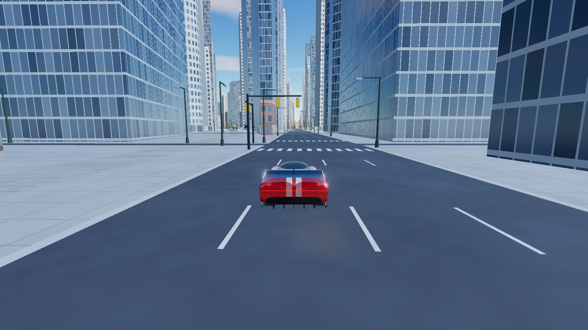

# Collect NYC

The five Collect cars (hypercar, 80s wedge, rally-raid, endurance, streamliner) driving through all of Manhattan in the browser: real streets, 45,000 real buildings, every street tree, timed collectible drops, a rival crew, seven races on real routes, a car-drop garage, and street furniture you can knock over.

**Play it:** https://collect-nyc-chi.vercel.app



## Controls

| Key | |
|---|---|
| WASD / arrows | drive |
| Space | handbrake |
| C | camera |
| R | back on the street (in a race: back on the route in a fresh car) |
| F | repair |
| 1–5 | change car |
| T / E | jump to the next race start / start the race |
| G / E | go to the Collect Garage / enter and pull a car; D drives the pulled car |
| I | collection |
| Esc | leave a race or the garage |
| F3 or ` | debug readout |

## How it's built

- **The city is real map data, pre-cut into tiles.** `scripts/build_tiles.py` turns NYC Open Data building footprints (with roof heights), the NYC shoreline and OpenStreetMap streets into 1,148 gzipped 250 m tiles, a low-detail skyline of the whole island and a street graph. `scripts/details.py` adds lane markings, crosswalks, curbs, street lamps, traffic signals at the real signalised intersections, 194,000 trees (the 2015 Street Tree Census plus park woodland) and rooftop water towers. The game streams tiles around the car.
- **The game** is Vite + TypeScript + Three.js + Rapier (`game/`). The cars, their physics and damage come from an earlier derby game with the same five cars. Race and rival AI drive routes found on the street graph.
- **The Collect Garage** simulates "Collect Car · Drop 01" (DEMO data, demo price, no real money): 1,000 editions in five tiers, a verifiable random pull, a roller door and a turntable reveal.
- Everything was built with Claude Code.

## Run it

```bash
sh scripts/fetch_data.sh
uv run --python 3.12 --with shapely,numpy,mapbox_earcut scripts/build_tiles.py
cd game && npm install && npm run dev     # http://127.0.0.1:5191
```

The data download is about 100 MB; the build takes about 25 seconds and writes `game/public/city/` (about 40 MB). `?car=rally` picks the starting car and `?at=x,z` the start spot (metres; Times Square is 0,0). In the dev console, `__nyc.autopilot = true` lets the race AI drive your car.

The world is flat and in metres, rotated 29° so the avenues run along Z (uptown is −Z). Where the FDR and other highways run under decks or over low sheds, the builder cuts the highway out of those footprints so the roads stay open.

## Data

- Buildings: NYC Open Data, Building Footprints (5zhs-2jue)
- Shoreline: NYC Open Data, Borough Boundaries (gthc-hcne)
- Street trees: NYC Open Data, 2015 Street Tree Census (uvpi-gqnh)
- Streets, parks, water and traffic signals: © OpenStreetMap contributors, ODbL

## Folders

| Path | What |
|---|---|
| `BRIEF.md` | the game idea, decisions and status, in order |
| `scripts/` | data download, city tile builder, street detail |
| `data/raw/` | the downloaded data (not in the repo) |
| `game/` | the browser game |
| `renders/` | screenshots |
